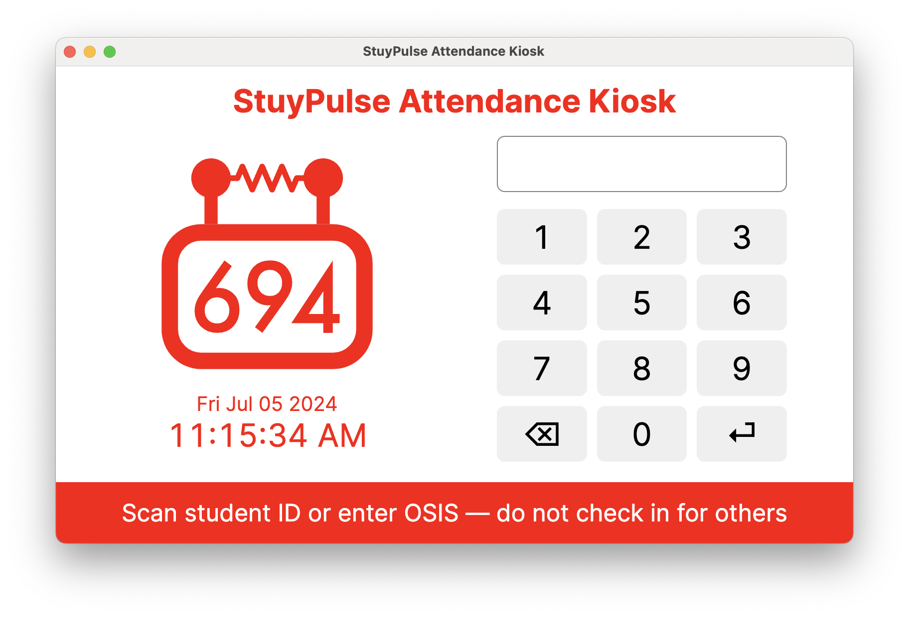

StuyPulse Attendance Kiosk
==========================

Attendance kiosk for robotics meetings. Designed for the Raspberry Pi 7" touchscreen (800x480 resolution). Built with
Electron and React.



## Exporting reports

Attendance data is stored locally on the device in a SQLite database. To export attendance reports, insert a USB drive
and triple tap on the 694 logo. The following report types are available:

- **Attendance Report** - Number of meetings attended, attendance rate, number of checkouts, checkout rate, and average
  and total time spent at meetings for each student
- **Meeting Report** - Total unique checkins and checkout rate for each meeting day
- **Checkin Data** - Checkin/checkout times and total time spent at meeting for each student on each meeting day
  (basically raw swipe data grouped by student and day)

Each of these reports is filtered by the specified date range and meeting threshold. The meeting threshold is the number
of unique checkins required for a given day to be considered a meeting. This prevents presumably unofficial meetings
from skewing the statistics.

A student counts as having checked out on a given day if their first and last swipes on that day are more than 30
minutes apart. This is to prevent multiple checkins in quick succession but no actual checkout (e.g. if the student
forgot if they already swiped in and swiped in again) from bringing down the student's average time spent at meetings.

## Importing Student Names

Students are stored in the database using their unique 9-digit ID number, but their names can be imported using a .csv file. It should follow the provided format below, including the necessary header.

    id_number,first_name,last_name
    123456789,John,Doe
    694694694,Jane,Doe

## Development

To run the app in development mode, run:

```bash
npm start
```

This will start the Electron app with hot reloading enabled. Changes to the frontend (renderer process) code will take
effect automatically, but changes to the main process require restarting the app.

## Building

To build an `arm64` deb package for the Raspberry Pi, ensure that Docker is installed and run:

```bash
npm run build
```

The package for the Raspberry Pi will be written to `out/make/deb/arm64/attendance-kiosk_1.0.0_arm64.deb`.

## Raspberry Pi setup

Install the latest Raspberry Pi OS onto a microSD card using the Raspberry Pi Imager, then insert the microSD card into
the Raspberry Pi and boot. Connect to Wi-Fi.

Upgrade and install packages:

```bash
sudo apt-get update
sudo apt-get upgrade

# Can't go without it
sudo apt-get install vim

# For debugging the SQLite database
sudo apt-get install sqlite3
```

Add the following to `/boot/firmware/config.txt` to enable charging the real-time clock battery (if applicable):

```
dtparam=rtc_bbat_vchg=3000000
```

In the Raspberry Pi Configuration, set up the following:

- Set the hostname to `attendance-kiosk`
- Set the locale to `en_US.UTF-8`
- Set the timezone to `America/New_York`
- Set the keyboard layout to `Generic 104-key PC` with `English (US)`
- Set the Wi-Fi country to `US`

Install the attendance kiosk package:

```bash
sudo dpkg -i attendance-kiosk_1.0.0_arm64.deb
```

Set up log directory (assuming the default user is `stuy694`):

```bash
sudo mkdir /var/log/attendance-kiosk
sudo chown stuy694:stuy694 /var/log/attendance-kiosk
```

Add the following to `~/.config/labwc/autostart` to autostart the attendance kiosk on boot, filling in the environment
variables accordingly:

```bash
SLACK_TOKEN="..." \
SLACK_EXPORT_USER_ID="..." \
MYPULSE_API_KEY="..." \
AWS_REGION="..." \
REPORT_EMAIL_TO_ADDRESS="..." \
BACKUP_S3_BUCKET="..." \
BACKUP_S3_PREFIX="..." \
attendance-kiosk --kiosk >> /var/log/attendance-kiosk/out.log 2>> /var/log/attendance-kiosk/err.log
```

Then reboot the Raspberry Pi for everything to take effect.
